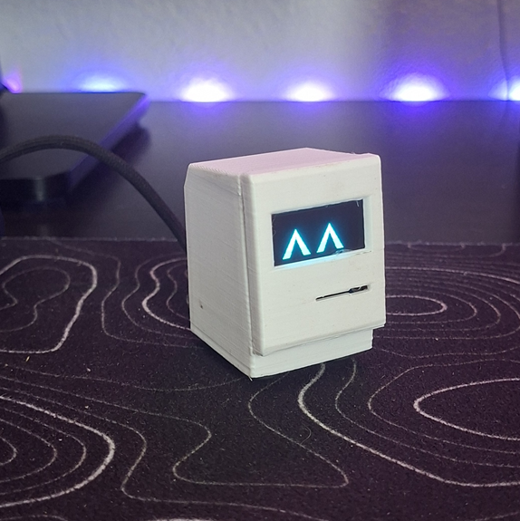
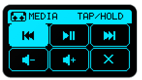
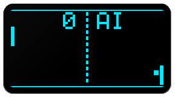
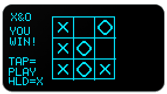
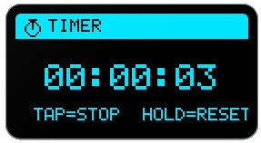
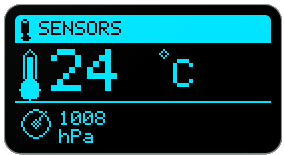
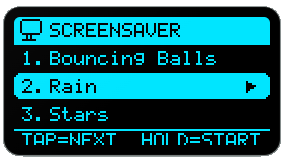
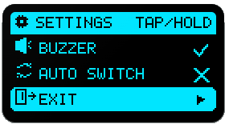
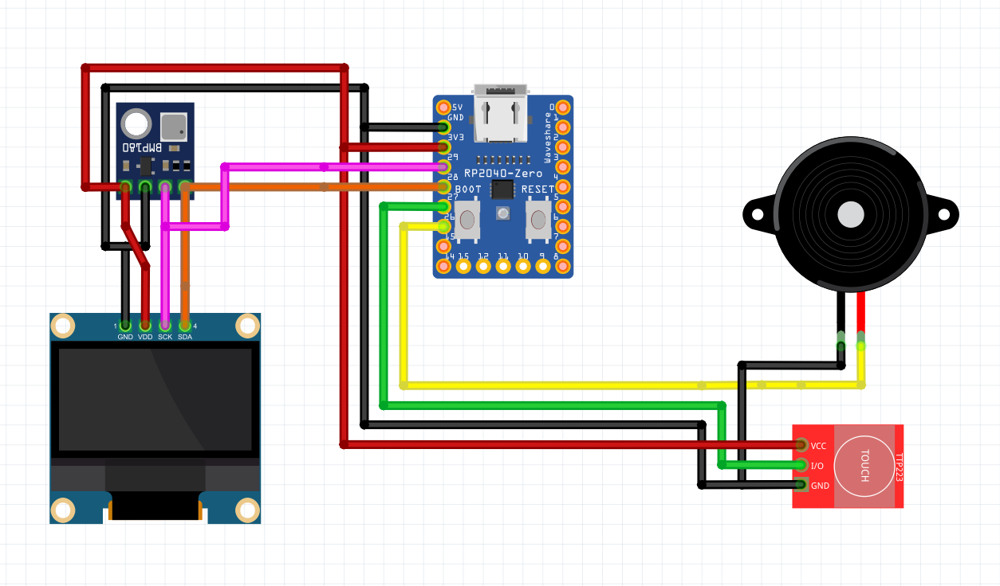
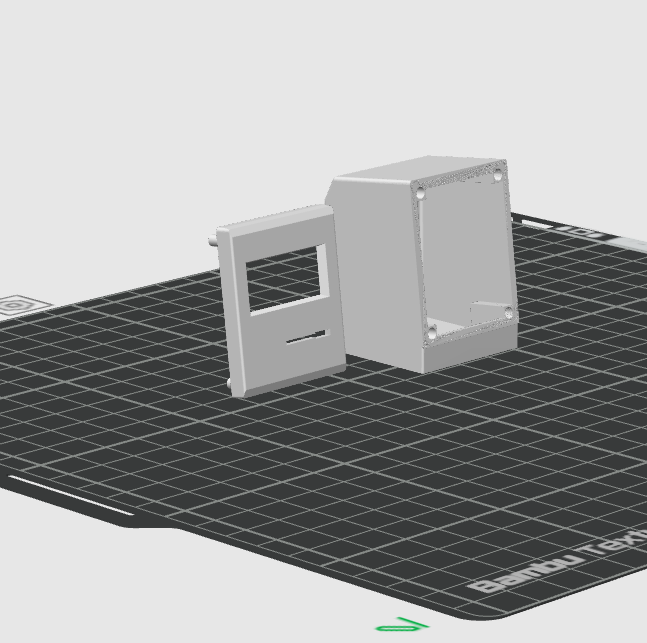

# Desktop Pet V0.1

- A simple desktop pet that makes your desk more intreasting  :D

You can have a demo at the desktop pet's firmware [(Here)](https://adium1000.github.io/Desktop-Pet/)

- This is a Media Controller app for your device that supplyes power to the Desktop Pet
- Tap the touch sensor to navigate and hold to execute the selected action
- It uses Adafruit Tiny USB to do that

- Pong is an game for your Desktop Pet
- To play just tap on the touch sensor to move the paddle
- When you lose (ai scores) you can long press to exit or tap to play again

- X&0 is also a game for your Desktop Pet
- To play you have to tap on the touch sensor and hold where you want to place x (you always play as x)
- You can exit by holding on the touch sensor one the match is finnished and tap to play again

- Timer is a small app that can count time when you start it
- To start the timer tap on the touch sensor, and to stop tap again
- To exit, stop the timer and hold the touch sersor, if you hold while timer is going you will reset the timer

- Sesors app lets you acces the BM180 Sensor's data like temperature and atmosferic presure
- Hold the touch sensor to exit

- Screensavers are a way to bring more fun to the pet, here you can pick from a large library of them and play them!
- While on screensver tap the touch sensor to exit or hold to exit to the screensaver library

- The settings app lets you turn off the buzzer or turn on automatic switch which will cycle between FACE-TEMP-AP
- Go to the exit button and hold the touch to exit

- When oppened from launcher it turns off the oled
- Tap the touch sensor to turn oled back on

- Here you will find all relevant stuff about this project and how it was made

- The schematics for this project were made in Fritzing 

This project uses an 0.9 Inch OLED with a WS RP2040 Microcontroller, a buzzer, a touch sensor and a BM180 sensor

- The firmware for this desktop pet is located in `CAD/Firmware` and it is ment for RP2040 Microcontrollers 

- The case was originaly created by Thingiverse user visakhmv, and is licensed under Creative Commons - Attribution - Share Alike, remixed by Adium1000
- All components are installed in the case using hot glue

| # | Component | Price | Note |
|---|---|---|---|
| 1 | Waveshare RP2040-Zero | ~$4.80 | LCSC/AliExpress |
| 2 | Passive Buzzer Module | ~$0.50 |  AliExpress |
| 3 | BMP180 Sensor Module (GY-68) | ~$0.60 | AliExpress |
| 4 | Touch Sensor (TTP223B) | ~$0.40 | AliExpress |
| 5 | Fire (Dupont wires, set) | ~$1.00 | M-M or M-F |
| 6 | ~19g filament PLA | ~$0.48 | ~$0.025/g × 19g |
| | **TOTAL** | **~$7.78** | |